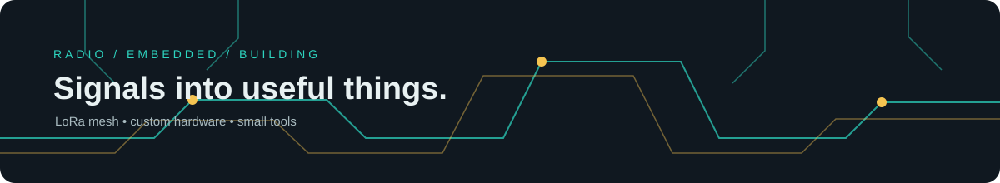

# Hi, I'm Sviatoslav

I study electronics at Lviv Polytechnic (Department of Electronic Engineering, Ukraine).
I like radio, embedded systems and building small tools that do one thing well.

## What I'm working on

My research project is a LoRa mesh pager: a handheld device for short text messages
where there is no cellular network or internet. I'm designing my own PCB for the
Ukrainian 433 MHz band instead of using an off-the-shelf board, and I'm looking at
low latency, one-time packets, forward secrecy and voice input with a throat mic.

The first finished piece of it is [lora-calc](https://github.com/Spleps/lora-calc),
a calculator for LoRa airtime, sensitivity and range.

## Currently learning / exploring

- LoRa mesh networking and custom RF hardware
- Embedded security and forward secrecy
- Low-power PCB design
- Reliable short-message systems for disconnected environments

## Projects

- **[lora-calc](https://github.com/Spleps/lora-calc)**: command line tool and Python library for LoRa link planning, with Meshtastic presets and UA_433 limit checks.
- **[solana-memecoin-tracker](https://github.com/Spleps/solana-memecoin-tracker)**: Telegram bot for Solana memecoin watchlist alerts, new pair discovery and rug checks.
- **[MemeForge](https://github.com/Spleps/MemeForge)**: small React app that turns one idea into a name, ticker, lore and first posts for a fictional memecoin.
- **[ua-433-mesh-lab](https://github.com/Spleps/ua-433-mesh-lab)**: deterministic simulator for adaptive LoRa-style mesh routing and short-lived packets.
- **[memecoin-risk-lab](https://github.com/Spleps/memecoin-risk-lab)**: offline, explainable risk scoring for exported Solana token snapshots.

## How the projects fit together

The repositories cover two connected areas of experimentation:

```text
LoRa research:       ua-433-mesh-lab -> lora-calc -> future custom PCB/firmware
Memecoin tooling:    MemeForge -> solana-memecoin-tracker -> memecoin-risk-lab
```

For example, `MemeForge` creates a fictional concept and launch copy, the tracker observes
real-time token metadata without executing trades, and Risk Lab analyses a saved snapshot with
repeatable rules. The radio projects follow the same transparent-prototype approach: calculate
and simulate design decisions before moving to hardware.

## Examples

### Electronics research

```text
Question: should a nearby mesh hop prioritize speed or range?
Tool:     ua-433-mesh-lab
Result:   compare a fast SF7/500 kHz hop with a robust SF10/125 kHz relay hop
```

### Memecoin analysis

```text
Input:    JSON snapshot with liquidity, holder concentration and authority flags
Tool:     memecoin-risk-lab
Result:   risk band plus the individual reasons that produced the score
```

These are educational and engineering prototypes. They are not trading advice, a radio
certification, or a guarantee that a token or communication link is safe.

## Tools I use


## Contact

Email: [batrakslava920@gmail.com](mailto:batrakslava920@gmail.com)
